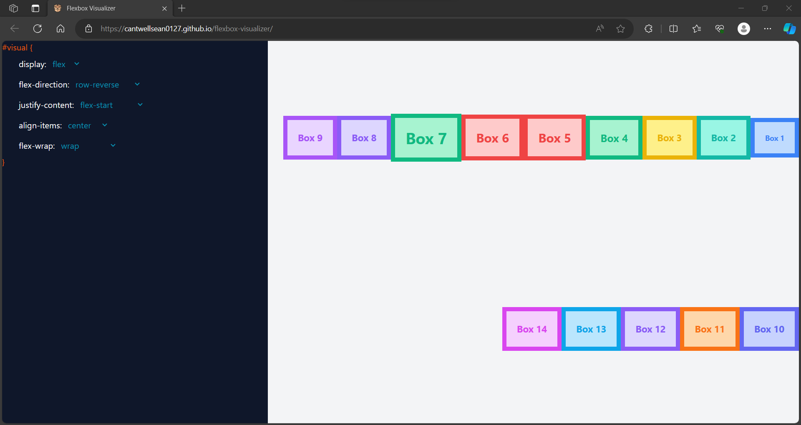

# Flexbox Visualizer
Welcome to the Flexbox Visualizer! An interactive tool designed to help developers understand and visualize how Flexbox works in real-time.

## Demo Image:

## Features
- Add Boxes: Simply press the Enter key to add a new box to the visualizer.
-  Remove Boxes: Press the Backspace key to remove the last box.
- Edit Box Details: Click on an individual box to edit it's properties and see the changes reflected instantly.

## How to Use
1. Visit the [Flexbox Visualizer](https://cantwellsean0127.github.io/flexbox-visualizer)
2. Start by adding boxes using the Enter key.
3. Customize each box by clicking on it.
4. Experiment and visualize how different properties and values affect the layout.

## Contributing
If you'd like to contribute, please fork the repository and make changes as you'd like. Pull requests are warmly welcome.

## Feedback
If you have any feedback or run into issues using the Flexbox Visualizer, please file an issue on this GitHub repository.

## License
This project is open-sourced under the MIT license. See LICENSE for details.
